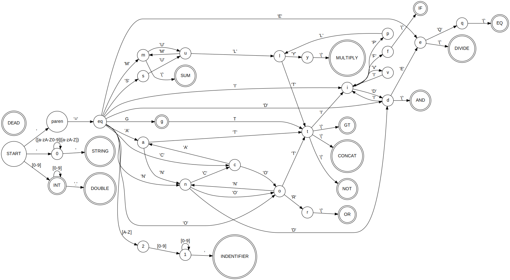

# spreadsheet evaluator
Lexes the input JSON file. Parses the AST. Interpretes the expressions and calculates the values. Compile with **cargo build**, run with **cargo run**
## Stages
### Lexer
Builds a finite state machine and makes lexemes outoff char vector.

### Parser
Generates and abstract syntax tree that contains nodes from from BNF grammar.
### Interpreter
Interpretes the AST and evaluates the expressions.
